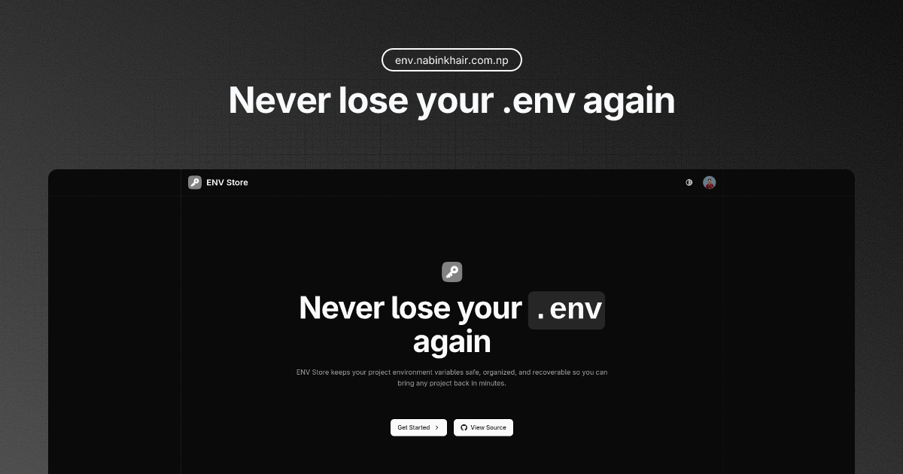

# ENV Store

Save and recover your project's environment variables, so you never lose them when machines die, folders get deleted, or repos get wiped.

 

  
  
  

  

## What it solves

`.env` files are fragile and siloed. If your project or device disappears, recreating all the keys is painful. ENV Store lets you keep project-scoped variables in one place and restore them in seconds—copy/paste or export a full `.env`.

## Live app

Use it here: https://envstore.nabinkhair.com.np

## Core features

- Project-scoped secret storage (`KEY=VALUE`)
- End-to-end encryption for all environment variables
- One-click copy for individual keys or full `.env` export
- Sign in with GitHub
- Works on any device with a browser

## How it works

1. Sign in with GitHub.
2. Create a project and add variables as `KEY=VALUE`.
3. When you need them again, copy single values or export a `.env` and paste into your codebase.

## Security

All environment variables are encrypted using industry-standard encryption before being stored in the database. Your data is decrypted only when you access it through the authenticated interface. Treat values as secrets, avoid sharing accounts, and rotate keys if exposed.
